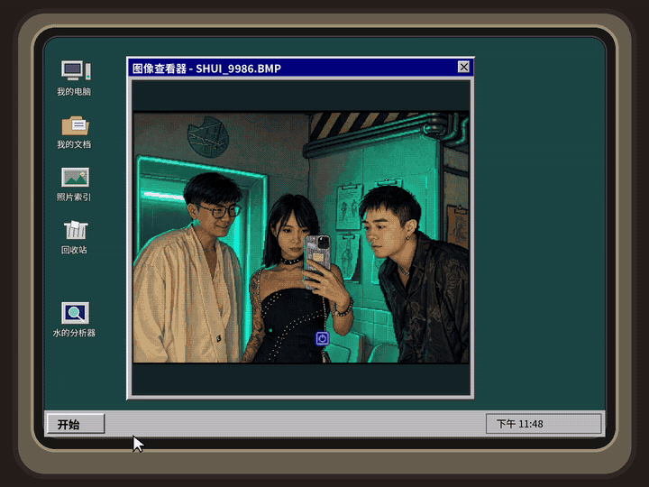
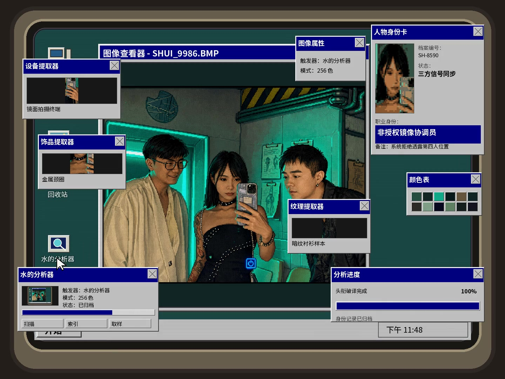

# 水的分析器 / shuishuidamowang-skill

> 把你的照片变成一台正在认真胡说八道的 90 年代电脑。  
> Turn a photo into a retro CRT / Windows 98 analysis interface that generates a deliberately absurd identity card.



## ✨ 它会做什么

上传一张照片后，Skill 会生成一套横向 4:3 的复古 CRT / Win98 风格界面，并通过 **「水的分析器」** 触发快速动态分析：

- 复古 Win95/98 风格中文桌面
- CRT 扫描线、轻微曲面与老显示器质感
- 点击「水的分析器」后快速爆出分析窗口
- 人物像素身份卡
- 随机生成一本正经但很离谱的职业头衔
- 饰品 / 纹理 / 场景细节提取
- 快速进度条与「正在破译头衔…」
- 最终结果停留，不会刚生成就消失
- 普通分析窗口锁定母图比例，避免人脸与物体被拉伸变形

## 🎬 V53 Final Locked

当前公开版本：**V53 Final Locked**

默认动画目标：

- 4:3 横构图
- 24 fps
- H.264 / yuv420p
- 约 3.5 秒
- 适合进一步转换成短实况 / Live Photo

### 最终交互

`桌面 → 鼠标点击「水的分析器」 → 快速弹窗 → 破译身份 → 离谱头衔 → 最终停留`

## 🖼️ 效果展示

静态预览：



完整短视频：[`assets/demo-v53.mp4`](assets/demo-v53.mp4)

## 📦 安装

### ChatGPT Skills

1. 下载本仓库，或下载打包好的 Skill ZIP。
2. 打开 ChatGPT 的 Skills 页面。
3. 选择创建 / 上传 Skill。
4. 上传 Skill ZIP，或按平台支持的方式上传 `SKILL.md`。
5. 上传一张照片并调用该 Skill。

> 如果平台要求 ZIP 内直接包含完整 Skill 目录，请保持 `SKILL.md`、`scripts/`、`examples/` 的相对路径不变。

## 🧠 设计原则

### Identity card = 人物

人物身份由身份卡负责。身份卡头像允许做受控的低分辨率像素化，但必须来自同一母图，不能重新生成一个陌生人物。

### Extractors = 世界

细节提取器尽量寻找：

- 耳环 / 项链 / 饰品
- 手机 / 手机壳
- 衣料纹理 / 印花
- 木纹 / 墙面 / 环境材质
- 灯光 / 反光 / 水面
- 山脊 / 雪地 / 背包 / 路面等风景细节

尽量避免重复提取完整人脸、头皮或没有信息量的空白区域。

## 📁 Repository structure

```text
.
├── SKILL.md
├── README.md
├── CHANGELOG.md
├── scripts/
│   └── render_live.py
├── examples/
│   └── animation_plan.json
└── assets/
    ├── demo-v53.gif
    ├── demo-v53.mp4
    └── demo-cover.jpg
```

## 📝 关于许可证

This project is released under the MIT License. See LICENSE for details.

## English summary

**shuishuidamowang** is a visual ChatGPT Skill that transforms photos into a retro CRT / Windows 98 interface. A user clicks the “水的分析器” launcher, analysis windows snap open, the system extracts source-locked visual details, creates a pixel identity card, rapidly “decodes” a ridiculous job title, and holds the completed result for readability.

The V53 Final Locked build emphasizes:
- fast under-4-second pacing,
- source-locked non-distorted popup imagery,
- asymmetrical Win98-style window composition,
- pixel identity portrait,
- multiple non-face detail extractors,
- and a final no-retreat display state.
